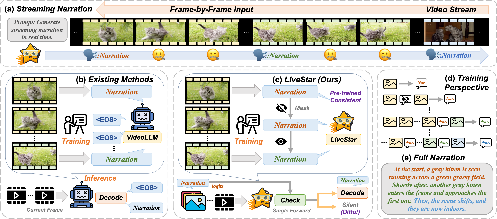
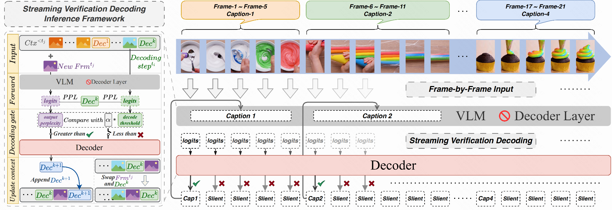
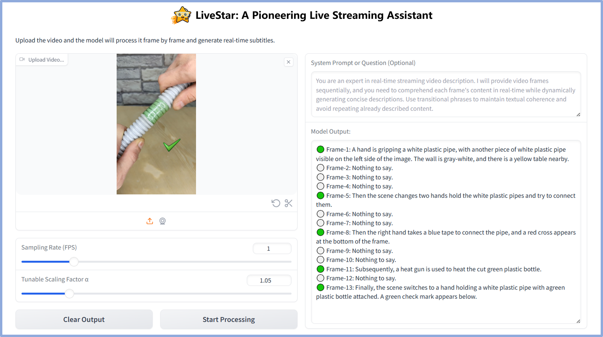
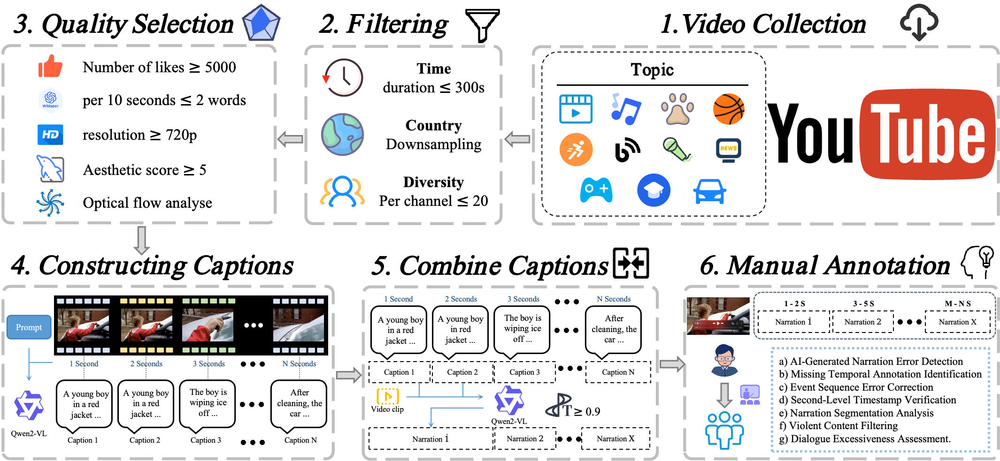
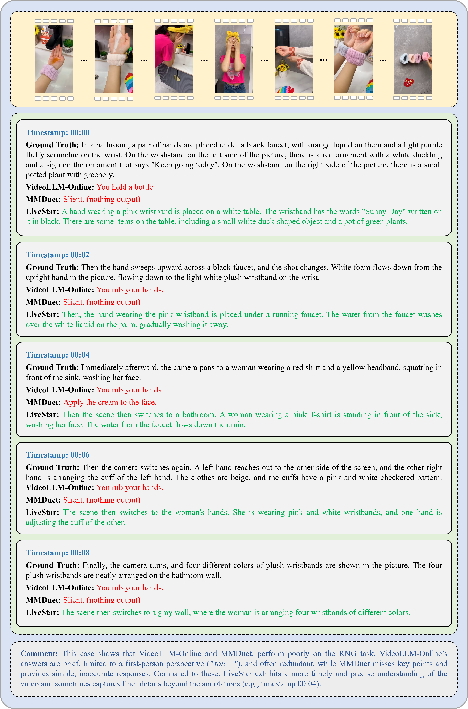

<div align="center">

# **LiveStar: Live Streaming Assistant for Real-World Online Video Understanding**

[\[🤖 HF Model (Anonymous)\]](https://huggingface.co/Anonymous4LiveStar/LiveStar_8B) [\[🤗 HF Dataset (Anonymous)\]](https://huggingface.co/datasets/Anonymous4LiveStar/OmniStar-RNG) [\[🎬 Base Model\]](https://huggingface.co/Anonymous4LiveStar/LiveStar_InternVideo_8B)

</div>

This is the **anonymous repository** for the paper ***LiveStar: Live-Streaming Assistant for Real-World Online Video Understanding***, providing code, data, and pipeline to support the LiveStar model and the OmniStar dataset introduced in the work. 🚀🚀🚀


## News & Updates 🚀  
- `2025-05-27`:  
  🔥 **Anonymous Release of LiveStar**: We've launched the [LiveStar-8B model](https://huggingface.co/Anonymous4LiveStar/LiveStar_8B) on Hugging Face for immediate online inference!  
  - **Current Features**:  
    ✔️ Full model weights accessible  
    ✔️ Basic inference pipeline integration  
  - **Coming Soon**:  
    📅 **OmniStar Dataset**: Full release pending completion of the peer-review process  
    ⚙️ **Extended Tools**: Enhanced training scripts and evaluation protocols  

## **Overview**

**Illustration of online video understanding.** (a) Taking the RNG task as an example, online video understanding requires Video-LLMs to handle continuous streams and output at appropriate times; (b) Existing methods overly rely on learning the EOS token, leading to poor inference performance; (c)-(e) LiveStar establishes an effective response-silence training and inference framework by SCAM and SVeD without compromising basic video understanding capabilities.



### **Abstract**

Despite significant progress in Video Large Language Models (Video-LLMs) for offline video understanding, existing online Video-LLMs typically struggle to simultaneously process continuous frame-by-frame inputs and determine optimal response timing, often compromising real-time responsiveness and narrative coherence. To address these limitations, we introduce LiveStar, a pioneering live streaming assistant that achieves always-on proactive responses through adaptive streaming decoding. Specifically, LiveStar incorporates: (1) a training strategy enabling incremental video-language alignment for variable-length video streams, preserving temporal consistency across dynamically evolving frame sequences; (2) a response-silence decoding framework that determines optimal proactive response timing via a single forward pass verification; (3) memory-aware acceleration via peak-end memory compression for online inference on 10+ minute videos, combined with streaming key-value cache to achieve 1.53× faster inference. We also construct an OmniStar dataset, a comprehensive dataset for training and benchmarking that encompasses 15 diverse real-world scenarios and 5 evaluation tasks for online video understanding. Extensive experiments across three benchmarks demonstrate LiveStar's state-of-the-art performance, achieving an average 19.5% improvement in semantic correctness with 18.1% reduced timing difference compared to existing online Video-LLMs, while improving FPS by 12.0% across all five OmniStar tasks. Our model and dataset can be accessed at https://anonymous.4open.science/r/LiveStar-5272.

## **Getting Started**

This guide provides step-by-step instructions to set up the LiveStar framework, including environment configuration, model acquisition, and dataset preparation. Current implementations focus on inference capabilities with partial resource availability.

### **Installation**

1. Clone the repository (Click `Download file`)
2. Install Python dependencies (Ensure you have Python version >= 3.9 installed). For GPU support, CUDA 12.2 or compatible drivers are required.
```bash
conda create -n LiveStar -y python=3.9.21
conda activate LiveStar
conda install -y -c pytorch pytorch=2.5.1 torchvision=0.10.1
pip install transformers==4.37.2 opencv-python==4.11.0.84 imageio==2.37.0 decord==0.6.0 gradio==4.44.1
pip install flash-attn --no-build-isolation
```
Alternative: Install via requirements.txt (recommended):
```bash
pip install -r requirements.txt
```

### **Model Acquisition**

1. Download Fine-Tuned LiveStar Model (Recommended):

(1) Download the LiveStar-8B model from Hugging Face:

```Bash
git clone https://huggingface.co/Anonymous4LiveStar/LiveStar_8B
```

(2) Move model weights to the inference directory:

```Bash
mv LiveStar_8B/*.safetensors inference/
```

2. SFT Training from Scratch (Advanced):

(1) Download the base pre-trained model:

```bash
git clone https://huggingface.co/Anonymous4LiveStar/LiveStar_InternVideo_8B
```

(2) Prepare weights for fine-tuning:
```bash
mv LiveStar_InternVideo_8B/*.safetensors inference/
```

### **Data Preparation**

(1) Download the OmniStar dataset from Hugging Face (We will open source it after the review process is completed):


```bash
git clone https://huggingface.co/datasets/XXX/OmniStar
```

*For review purposes only*: You may examine sample annotations from the OmniStar-RNG subset:  

```bash
git clone https://huggingface.co/datasets/Anonymous4LiveStar/OmniStar-RNG
```

(2) Navigate to the dataset directory:


```bash
cd OmniStar
```


(3) Concatenate the split files:

Use the cat command to concatenate all the split files into a single file. The split files are named from allVideos.part_aa to allVideos.part_ch, you can use the following command:

```Bash
cat allVideos_tar_sep/allVideos.part_* > allVideo.tar.gz
```

(4) Verify the integrity of the file (optional):

Use the md5sum command to compute the checksum of the concatenated file and compare it with the provided checksum 43d6777701f8bfbfcc7854304245cc2c:

```Bash
md5sum allVideo.tar.gz
```

The output should look like this:

```Bash
43d6777701f8bfbfcc7854304245cc2c  allVideo.tar.gz
```

If the checksum matches 43d6777701f8bfbfcc7854304245cc2c, the file is intact and correct.

(5) Extract the concatenated file:

Use the tar command to extract the contents of allVideo.tar.gz:

```Bash
tar -xzvf allVideo.tar.gz
```

After completing these steps, you should see the extracted video files in the current directory.

## **Inference**



To run an inference with the LiveStar model, follow these steps:

(1) Before using LiveStar for inference, ensure you have downloaded the pre-trained model weights. Then, navigate to the inference directory:
   ```bash
   cd LiveStar/inference
   ```

(2) Ensure that the model path in your script matches the actual path to the downloaded weights: `model_path = 'LiveStar/inference'`. To use your own video file, modify the following line: `video_path = "sample.mp4"`.

(3) Execute the inference script using the following command:
   ```bash
   python demo.py
   ```
(4) If you want a more intuitive experience, we provide a visualization demo based on Gradio. Please run:
   ```bash
   python demo_ui.py
   ```


## **Training**

### **1. Prepare *Frame-Caption* Format Data**

(1) To fine-tune the LiveStar model, prepare your own Supervised Fine-Tuning (SFT) dataset as interleaved frame-caption sequences. Create a `.jsonl` file under the `LiveStar/datasets` directory, following the structure of `train_data.jsonl`.

(2) Next, create a meta file in JSON format under the `LiveStar/shell/data` directory. This file should provide metadata for your dataset and follow the format shown in `omnistar_train_sample.json`.


### **2. Fine-tune the Pre-trained Model**
You can fine-tune the [LiveStar-8B](https://huggingface.co/Anonymous4LiveStar/LiveStar_8B) model directly (recommended), or start from the base [LiveStar-InternVideo-8B](https://huggingface.co/Anonymous4LiveStar/LiveStar_InternVideo_8B) model for full SFT training. You may choose to fine-tune the model using either the full-parameter fine-tuning script or the lightweight LoRA adapter depending on your available GPU resources.


Before starting fine-tuning, make sure to set the `--meta_path` argument to the JSON meta file you created in the previous step.  

The model path in the shell scripts is set to `./inference` by default.

In the default configuration, the visual encoder is frozen to reduce memory usage. You may unfreeze it if you wish to improve performance, especially if you have sufficient computational resources.

🎈 Fine-tuning the full model typically requires 8× A800 80G GPUs.  
🎈 Fine-tuning with LoRA is much lighter and can be done with just 2× A800 80G GPUs.  

Example fine-tuning commands:
```bash
# Fine-tune the full LiveStar model with 8 GPUs (~77GB per GPU)
GPUS=8 PER_DEVICE_BATCH_SIZE=2 sh shell/scripts/LiveStar-8B_full.sh

# Fine-tune LiveStar with LoRA on 2 GPUs (~79GB per GPU)
GPUS=2 PER_DEVICE_BATCH_SIZE=2 sh shell/scripts/LiveStar-8B_lora.sh
```

## **OmniStar (Coming Soon)**

This section provides instructions for reproducing the annotation and evaluation of OmniStar.



### **1. Data Filtering**

Run the following commands to obtain filtered videos. 

Firstly, you should install [Open-Sora](https://github.com/hpcaitech/Open-Sora/tree/main/tools), and have a raw video dataset prepared. A meta file of the dataset information is needed for data processing. To create a meta file from a folder, run:

```Bash
python -m Data_Filtering/Open-Sora-main/tools.datasets.convert video /path_to_your_video_folder --output /path_to_save_your_meta.csv
```

Then, run the following commands to get aesthetic scores and optical flow scores of your videos. Make sure the meta file has column 'path'.

```Bash
torchrun --nproc_per_node 8 -m Data_Filtering/Open-Sora-main/tools.scoring.aesthetic.inference /path_to_save_your_meta_with_aesthetic_scores.csv --bs 1024 --num_workers 16
torchrun --standalone --nproc_per_node 8 Data_Filtering/Open-Sora-main/tools/scoring/optical_flow/inference.py /path_to_save_your_meta_with_optical_flow_scores.csv
```

With these information of videos above, you can filtering is conducted to retain only those videos containing 5 to 15 scenes,Then you can retain videos with an aesthetic score of 4 or above and with optical flow scores within the range of 0.5 to 100

### **2. Video Frame Extracting**

Video frame extraction can be directly run the following code. Run the following command:

```Bash
python utils/extract_video_frame.py --data_dir allVideo --output_dir allVideo_frame
```



